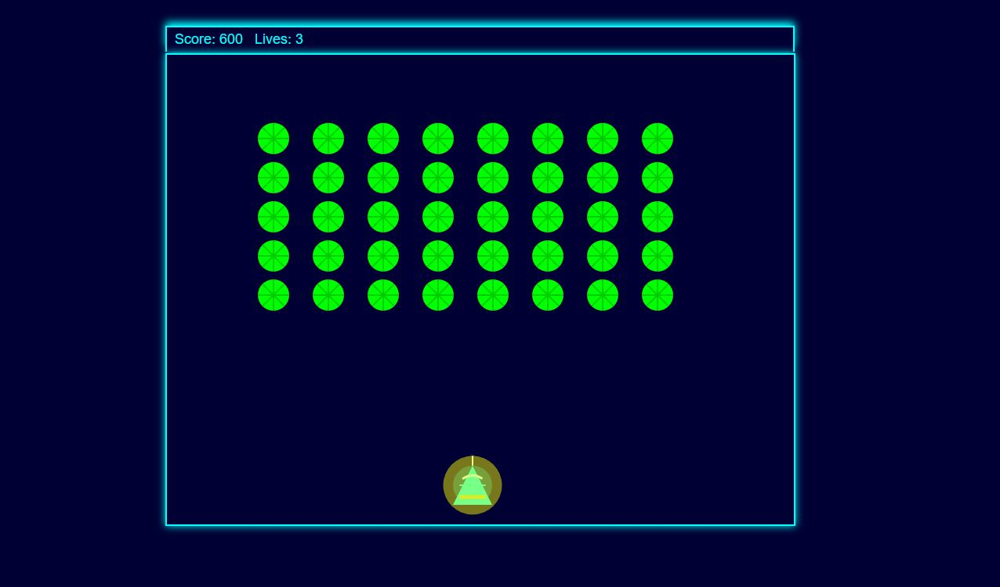

# CyberInvaders

CyberInvaders is a Space Invaders style game designed to help educate people about cyber security. This project aims to make learning about cyber security concepts fun and engaging.

## Table of Contents
- [Introduction](#introduction)
- [Features](#features)
- [Installation](#installation)
- [Usage](#usage)
- [License](#license)

## Introduction
CyberInvaders is an educational game that combines the classic mechanics of Space Invaders with cyber security concepts. Players will defend against various cyber threats, learning how to recognize and mitigate them.



## Features
- Classic Space Invaders gameplay
- Educational content on cyber security
- Engaging and interactive learning experience
- Multiple levels with increasing difficulty

## Installation
To get started with CyberInvaders, follow these steps:

1. Clone the repository:
    ```sh
    git clone https://github.com/dwain-barnes/CyberInvaders.git
    ```
2. Navigate to the project directory:
    ```sh
    cd CyberInvaders
    ```
3. Open `index.html` in your preferred web browser to start the game.

## Usage
- Use the arrow keys to move your spaceship.
- P button to pause
- Press the space bar to shoot.
- Defend against incoming cyber threats and learn about different types of cyber attacks.

## License
This project is licensed under the MIT License. See the [LICENSE](LICENSE) file for more details.
